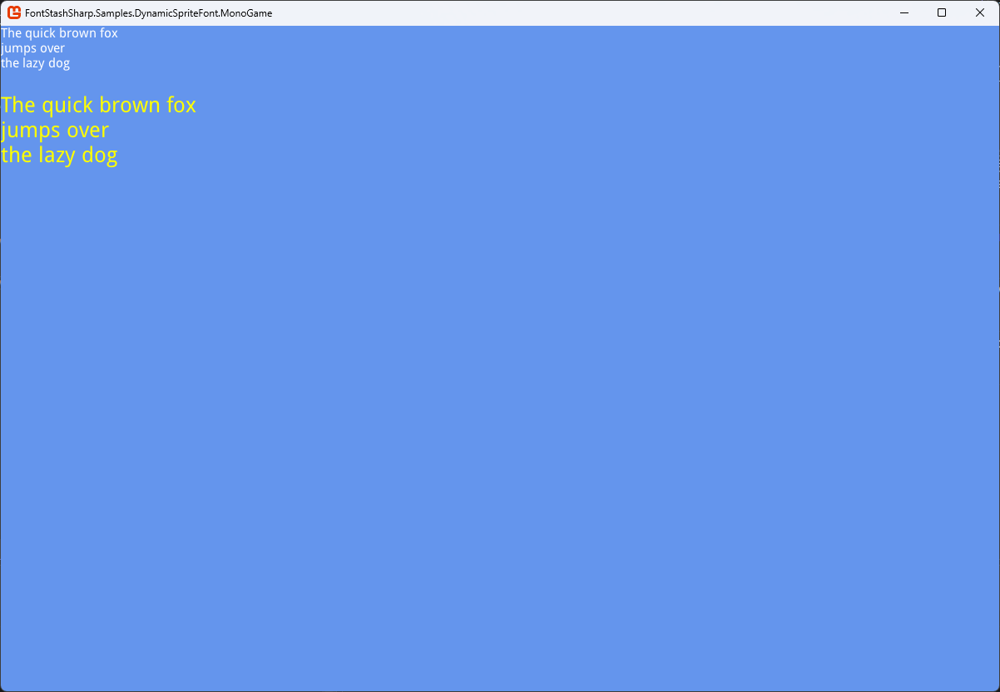

# Getting Started

## Adding Reference
Following platforms have their own versions of FontStashSharp that are available at the nuget:
Platform|Link
--------|----
[MonoGame](https://monogame.net/)|https://www.nuget.org/packages/FontStashSharp.MonoGame
[Stride](https://www.stride3d.net/)|https://www.nuget.org/packages/FontStashSharp.Stride
[Kni](https://github.com/kniEngine/kni)|https://www.nuget.org/packages/FontStashSharp.Kni
XNA|https://www.nuget.org/packages/FontStashSharp.XNA

See [this](adding-reference-to-fna.md) on how to add the reference to FNA

## Basic Usage
Following code creates FontSystem from a ttfs:
```c#
    private SpriteBatch _spriteBatch; 
    private FontSystem _fontSystem;

    /// <summary>
    /// LoadContent will be called once per game and is the place to load
    /// all of your content.
    /// </summary>
    protected override void LoadContent()
    {
        // Create a new SpriteBatch, which can be used to draw textures.
        _spriteBatch = new SpriteBatch(GraphicsDevice);

        _fontSystem = new FontSystem();
        _fontSystem.AddFont(File.ReadAllBytes(@"Fonts/DroidSans.ttf"));
    }
```

Now the text could be drawn using following code:
```c#
    protected override void Draw(GameTime gameTime)
    {
        GraphicsDevice.Clear(Color.CornflowerBlue);

        // Render some text
        _spriteBatch.Begin();

        SpriteFontBase font18 = _fontSystem.GetFont(18);
        _spriteBatch.DrawString(font18, "The quick brown fox\njumps over\nthe lazy dog", new Vector2(0, 0), Color.White);

        SpriteFontBase font30 = _fontSystem.GetFont(30);
        _spriteBatch.DrawString(font30, "The quick brown fox\njumps over\nthe lazy dog", new Vector2(0, 80), Color.Yellow);

        _spriteBatch.End();

        base.Draw(gameTime);
    }
```

It would render following:


